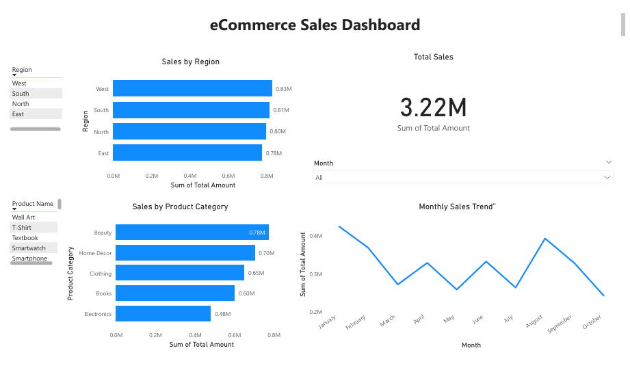

# 📊 E-Commerce Sales Analysis

## Overview
This project analyzes e-commerce sales data to uncover key business insights such as:
- Top-selling product categories
- High-performing regions
- Monthly sales trends
- Customer purchase patterns

The goal is to demonstrate data cleaning, data analysis, visualization, and dashboard development skills relevant for Data Analyst roles.

---

## Tools & Technologies Used

| Task | Tools Used |
|------|------------|
| Data Cleaning & Analysis | Python, Pandas, NumPy |
| Visualization | Matplotlib, Seaborn |
| Dashboard | Power BI |
| Version Control | Git, GitHub |

---

## Project Structure

Ecommerce-Sales-Analysis\
│\
├── data\
│ └── ecommerce_sales_data.csv\
│\
├── notebooks\
│ └── Ecommerce_Sales_Analysis.ipynb\
│\
├── dashboard\
│ └── Ecommerce_Sales_Dashboard.pbix\
│\
├── images\
│ └── dashboard.png\
│\
└── README.md

---

## Steps Performed

### 1. Data Cleaning
- Checked for missing values
- Converted `Order Date` to datetime format
- Created new fields such as **Month**, **Year**, and **Total Amount**

### 2. Exploratory Data Analysis (EDA)
- Sales by category
- Sales by region
- Monthly and seasonal trends
- Customer purchase behavior

### 3. Data Visualization
- Bar charts, line charts, and pie charts using Python
- Interactive dashboard in Power BI

---

## Dashboard Preview

---

## Key Insights

- Clothing and Home Decor categories generated the highest revenue.
- The West region recorded the highest total sales.
- Sales show peaks in January and August.
- Repeat customers have a significant impact on total revenue.

---

## How to Run This Project

### Clone the repository:

git clone https://github.com/Chandinibc22/Ecommerce-Sales-Analysis.git

### Install required libraries:

pip install pandas numpy matplotlib seaborn

### Run the notebook:
Open `Ecommerce_Sales_Analysis.ipynb` in Jupyter/VS Code.

### View Dashboard:
Open `Ecommerce_Sales_Dashboard.pbix` in Power BI.

---

## Conclusion
This project demonstrates:
- Practical data analysis workflow
- Ability to derive business insights
- Dashboard reporting for decision-making

It serves as a strong foundation for roles in **Data Analytics**, and future learning in **Data Science & Machine Learning**.

---

⭐ If you found this project helpful, feel free to star the repository!
